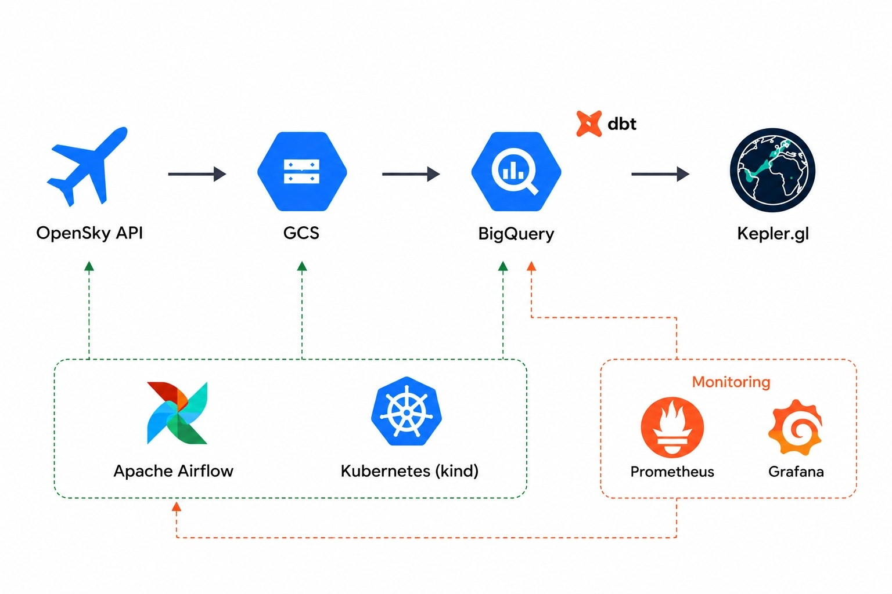
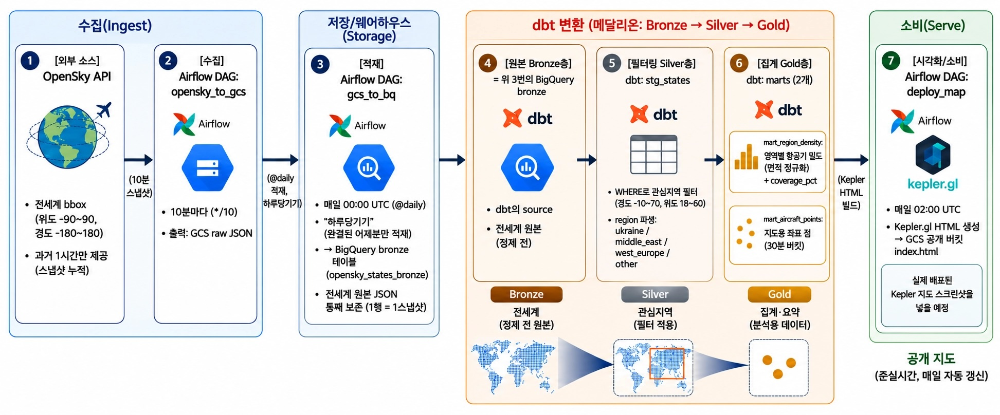
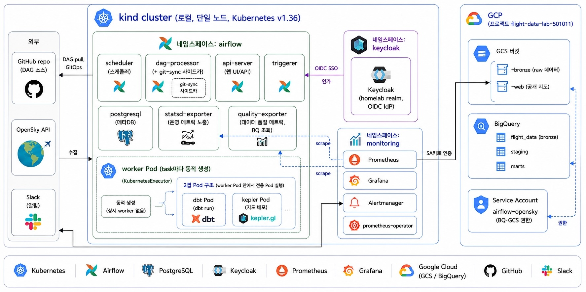
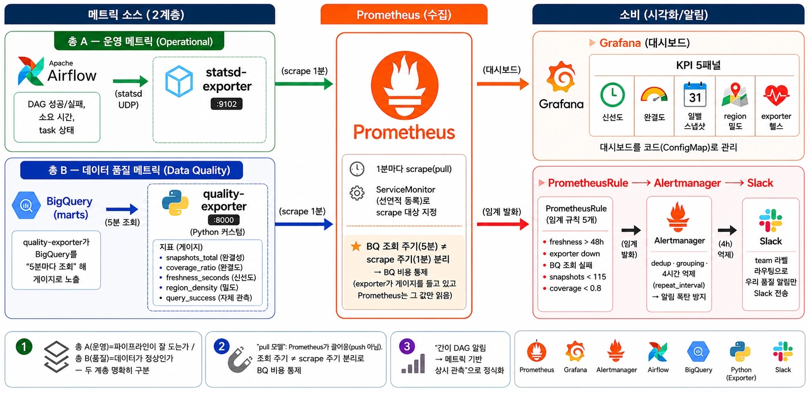

# flight-data-lab

**실시간 API 데이터를 분석 가능한 시계열 데이터로 만들어 분석해보기 - 수집 / 적재 / 모델링 E2E 파이프라인**

[OpenSky](https://opensky-network.org/)의 실시간 항공 위치를 Airflow로 정기 수집/적재/변환하고, 분쟁지역(우크라이나, 중동)의 영공 회피 패턴을 지도와 시계열로 분석한다.

---

## System Overview

  

---

## Live Demo

[지도에서 결과 확인](https://storage.googleapis.com/flight-data-lab-501011-web/index.html)

> 분쟁지역 상공의 **밀도 공백**과 주변국의 정상 밀집이 한눈에 대비된다

<!-- TODO: docs/images/kepler-map.png (실제 지도 스크린샷) -->

---

## Overview

**민항기는 분쟁지역 상공을 날지 않는다.** 러시아-우크라이나 전쟁 이후 항로 회피는 학술적으로 검증된 실재 현상이다[^1]. 

정말 분쟁지역 상공은 비행기 없이 깨끗할지 궁금했고, 관련 데이터를 수집하기 위해 OpenSky를 찾아보게 되었다. 그러나 OpenSky는 "지금 현재"의 스냅샷만 보여줄 뿐, 1시간이 지나면 그 데이터는 사라진다.

이 프로젝트는 **휘발성 스냅샷 데이터를 10분마다 수집하여 시계열 데이터로 축적**하고, 분쟁지역과 비분쟁지역의 영역별 밀도와 시간대 패턴을 비교 분석한다.

---

## Project Architecture

### 데이터 흐름
- **수집 (Ingest):** OpenSky API → GCS - 실시간 스냅샷은 1시간 뒤 사라지므로 raw JSON 그대로 저장한다.
- **저장 (Storage):** GCS → BigQuery bronze - 전세계 원본을 통째로 보존한다. *재수집이 불가능하므로* 관심지역만 골라 수집하지 않는다.
- **변환 (Transform):** dbt 메달리온(Bronze→Silver→Gold) - 원본 보존과 분석용 정제를 계층으로 나누고, Silver에서 관심지역만 필터링한다.
- **소비 (Serve):** Kepler.gl 공개 지도 — 매일 자동으로 재배포되는 준실시간 시각화.

> **핵심 원칙 — "수집은 전세계, 분석은 관심지역만":** 다른 주제(태평양, 북극 등)로 확장할 때 Silver의 `WHERE`만 바꾸면 되므로 재수집이 불필요하다.

 

### 인프라 아키텍쳐

- **실행 (Compute):** Airflow KubernetesExecutor on kind — task마다 worker Pod를 동적 생성해 상시 워커 없이 격리 실행한다.
- **격리 (Isolation):** dbt, 지도 배포는 worker Pod 안에서 다시 전용 Pod를 띄우는 2겹 Pod — 각 task의 의존성을 이미지 단위로 분리한다.
- **배포 (GitOps):** git-sync 사이드카 — DAG를 이미지에 굽지 않고 GitHub에서 pull. 코드 변경이 즉시 반영된다.
- **인증 (Auth):** SA키는 이미지에 굽지 않고 런타임 k8s Secret으로 주입 — 자격증명을 코드와 이미지에서 분리한다.

 

### 모니터링 아키텍쳐

- **A — 운영 메트릭:** Airflow statsd-exporter — "파이프라인이 잘 도는가"(DAG 성공/실패, 소요시간). airflow에서 생성되는 statsd 메트릭을 exporter 사용하여 prometheus로 수집
- **B — 품질 메트릭:** 커스텀 exporter가 BigQuery 조회 — "데이터가 정상인가"(스냅샷 수, 완결도, 신선도, 밀도)
- **수집 (Collect):** Prometheus (pull) — BigQuery 조회 주기(5분)와 scrape 주기(1분)를 분리해 조회 비용을 통제한다.
- **소비 (Consume):** Grafana 대시보드 + Alertmanager → Slack — 임계 알림에 4시간 억제를 걸어 장기 장애 시 알림 폭탄을 방지

---

## Tech Stack

**데이터 파이프라인**

| 레이어 | 도구 |
|---|---|
| 수집 (Ingest) | OpenSky API |
| 저장 (Storage) | Google Cloud Storage (raw), BigQuery (warehouse) |
| 변환 (Transform) | dbt (메달리온 Bronze→Silver→Gold), Cosmos (K8s 실행) |
| 시각화 (Serve) | Kepler.gl (GCS 정적 웹 호스팅) |

**플랫폼 / 운영**

| 레이어 | 도구 |
|---|---|
| 오케스트레이션 | Apache Airflow (KubernetesExecutor) |
| 인프라 (Infra) | Kubernetes (kind), Docker |
| 모니터링 | Prometheus, Grafana, Alertmanager, Slack |
| 인증 (Auth) | Keycloak (OIDC SSO) |

---

## Pipeline

5개의 독립 Airflow DAG가 하루 타임라인 위에서 시간 오프셋으로 연결된다.

| DAG | 스케줄 (UTC) | 역할 |
|---|---|---|
| `opensky_to_gcs` | 매 10분 | 수집: OpenSky → GCS raw |
| `gcs_to_bq` | 00:00 | 적재: GCS → BigQuery bronze (어제분 적재) |
| `dbt_transform` | 01:00 | 변환: bronze → staging → marts (dbt) |
| `deploy_map` | 02:00 | 배포: marts → Kepler HTML → GCS 공개 지도 |
| `check_completeness` | 02:30 | 감시: 완결성 부족 시 Slack 경고 |

---

## Findings

완결된 하루(전세계 수집 전환 후) 기준, 영역별 평균 항공기 밀도(면적 정규화):

| 영역 | 밀도 (aircraft/sq°) | 서유럽 대비 |
|---|---|---|
| 서유럽 (비교군) | **6.93** | — |
| 우크라이나 | **0.83** | **8.3× 낮음** |
| 중동 | **0.27** | **25.7× 낮음** |

분쟁지역의 영공 회피가 밀도 공백으로 뚜렷이 나타난다.

<!-- TODO: 시간대·요일 패턴 (#30 분석 완료 후 보강) -->

---

## Getting Started

> 로컬 kind 클러스터 + GCP 프로젝트가 필요하다. 아래는 개요이며, 상세는 각 문서 참조.

1. **kind 클러스터 + Airflow (Helm)** 배포 (`helm-values-airflow.yaml`)
2. **모니터링 스택** 배포 (`helm-values-monitoring.yaml`)
3. **Secret 생성** (repo에 미포함): `gcp-sa-key`, `opensky-credential`, `slack-webhook` 등
4. **이미지 빌드 + kind load**: `dbt-flight`, `kepler-map`, `flight-quality-exporter`
5. **DAG 배포**: git-sync가 GitHub에서 자동 pull

<!-- TODO: 상세 셋업 문서 링크 -->

[ADR-0001]: docs/adr/0001-dbt-scheduling-time-offset-vs-asset.md
[ADR-0002]: docs/adr/0002-data-quality-metrics-exporter-vs-pushgateway.md

[^1]: Ostroumov et al. (2022), *Preliminary Estimation of War Impact in Ukraine on the Global Air Transportation*, IEEE ACIT · DCU (2025), *Impact analysis of Russian-Ukrainian war on airspace*, J. Air Transport Management. — OpenSky ADS-B 데이터로 분쟁 영공 회피·항로 재설정을 정량 분석.
