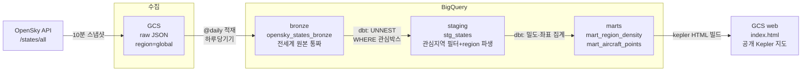
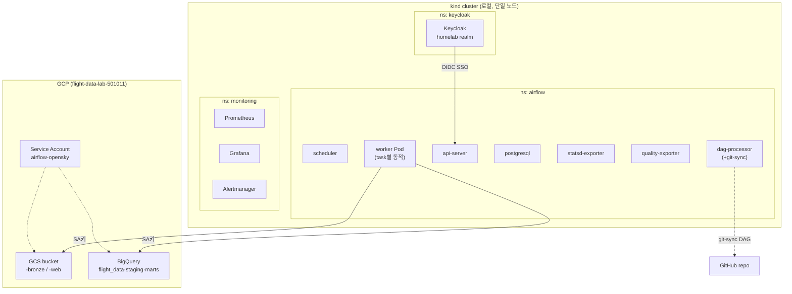
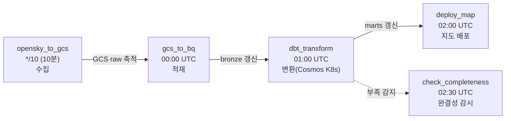
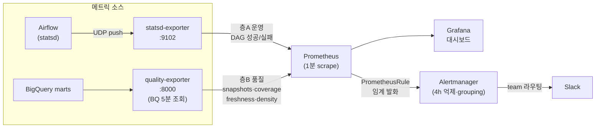
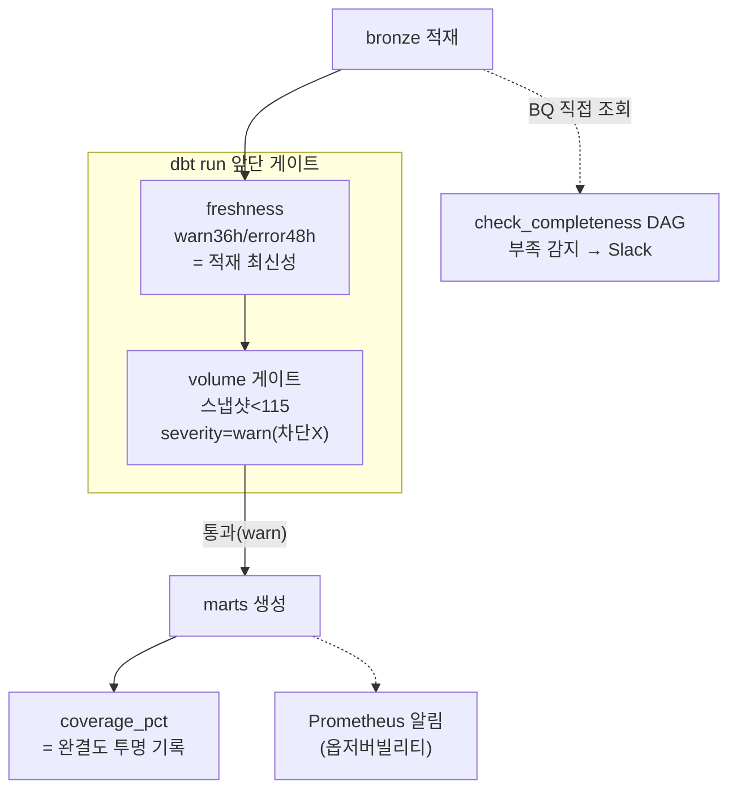
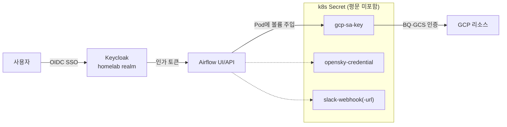

# 아키텍처

flight-data-lab은 OpenSky 실시간 항공 위치를 Kubernetes 위 Airflow로 정기 수집·적재·변환하고, 분쟁지역 영공 회피 패턴을 지도·시계열로 분석하는 데이터 파이프라인이다. 아래는 관점별 아키텍처 뷰다.

---

## ① 데이터 흐름 (Data Flow)

데이터가 수집부터 시각화까지 어떻게 이동·변환되는가. "수집은 전세계 raw, 분석은 관심지역"이 핵심 원칙이다.

- **bronze = 전세계 원본 자산**(과거 1h만 제공 → 재수집 불가 대비). staging부터 관심지역(유럽~중동)만 처리.
- **하루당기기**: 적재는 완결된 어제분만 담음(UTC 자정 경계 문제 해결).
- 나중에 다른 주제(태평양·북극 등)는 `stg_states`의 WHERE만 바꾸면 재수집 0.

---

## ② 인프라 / 배포 (Infrastructure)

무엇이 어디서 도는가. 로컬 kind(단일 노드 k8s) 위 네임스페이스별 배치 + GCP 관리형 스토리지.

- **KubernetesExecutor**: task마다 worker Pod를 동적 생성(상시 worker 없음). dbt·지도배포는 그 안에서 다시 전용 Pod를 띄우는 2겹 구조.
- **git-sync**: DAG를 GitHub에서 pull(GitOps). SA키는 이미지에 안 굽고 런타임 Secret 주입.

---

## ③ 오케스트레이션 (Airflow DAG)

5개 DAG가 시간 오프셋으로 연결된다. 각 DAG는 독립이며, 앞 DAG 완료 예상 시각 뒤에 다음이 스케줄된다.

- **시간 오프셋 채택**(asset 이벤트 아님): 적재가 규칙적(@daily·~1분) + freshness 게이트가 "실패 시 중단"을 이미 담당 → asset 이점 상쇄(ADR-0001).
- dbt는 게이트(freshness·volume)가 run 앞단에 자동 배치됨.

---

## ④ 모니터링 / 옵저버빌리티 (Observability)

메트릭과 알림이 어떻게 흐르는가. 운영(층 A)과 데이터 품질(층 B) 두 계층을 Prometheus로 수집한다.

- **조회 주기(5분) ≠ scrape 주기(1분) 분리**: exporter가 게이지를 들고 있고 Prometheus는 그것만 읽음 → BQ 비용 통제(pull 표준).
- 알림: `snapshots<115`·`freshness>48h`·`coverage<0.8`·exporter 헬스 → Alertmanager가 dedup·4h 억제 후 Slack.

---

## ⑤ 다층 방어선 (Data Reliability)

데이터 신뢰성을 어떻게 지키는가. **감지·차단·기록·알림을 분리**해, 복구 불가능한 과거 구멍이 미래 mart를 인질 잡는 교착을 피한다.

- **차단은 최소(warn), 감지·기록은 최대**: 외부 장애(OpenSky 503)로 인한 복구불가 구멍이 파이프라인을 막지 않도록 volume 게이트를 error→warn으로(B1 결정).
- 완결도는 막지 않고 `coverage_pct`로 투명 노출 → 소비자가 신뢰도 판단.

---

## ⑥ 보안 / 인증 (Security)

누가 무엇으로 인증하는가.

- **Keycloak SSO**: Airflow를 OIDC로 보호(홈랩 IdP 재사용 목적, 다른 서비스에도 확장 가능).
- **Secret**: SA키·OpenSky·webhook 전부 k8s Secret으로 런타임 주입. repo·이미지에 값 미포함(clone 시 생성 필요).

---

## 관점 요약

| 뷰 | 한 줄 |
|---|---|
| ① 데이터 흐름 | 전세계 수집 → 관심지역 분석, bronze는 재수집 불가 대비 원본 자산 |
| ② 인프라 | kind 위 3개 네임스페이스 + GCP 관리형 스토리지, KubernetesExecutor 2겹 Pod |
| ③ 오케스트레이션 | 5개 독립 DAG를 시간 오프셋으로 연결(asset 대신, ADR-0001) |
| ④ 모니터링 | 운영·품질 2계층 메트릭 → Prometheus → Grafana/Alertmanager → Slack |
| ⑤ 다층 방어선 | 감지·차단·기록·알림 분리, 차단은 최소(warn) |
| ⑥ 보안 | Keycloak SSO + Secret 런타임 주입 |
